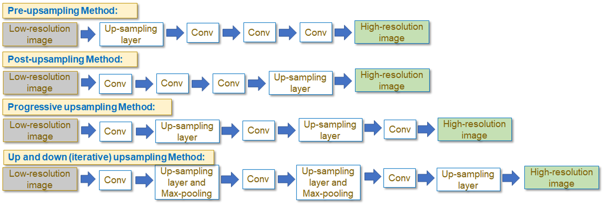
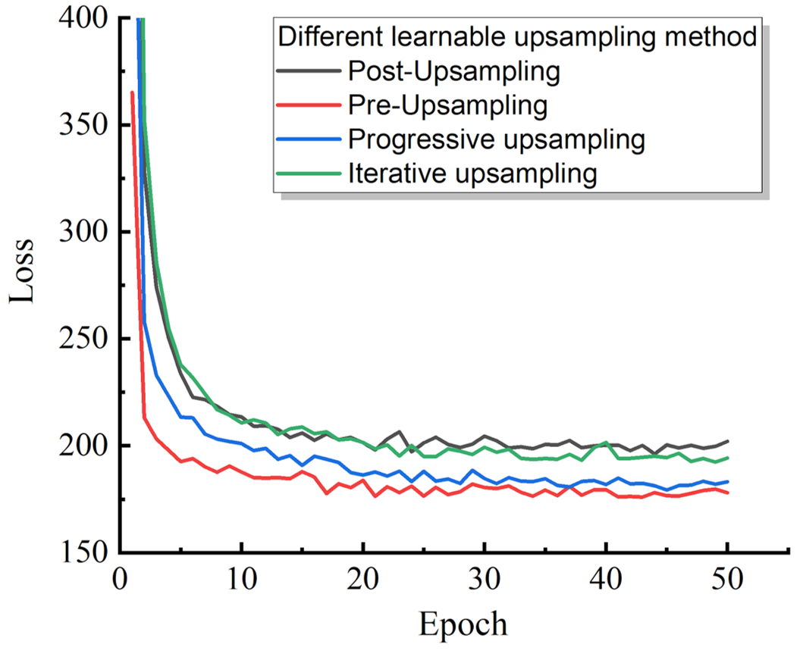
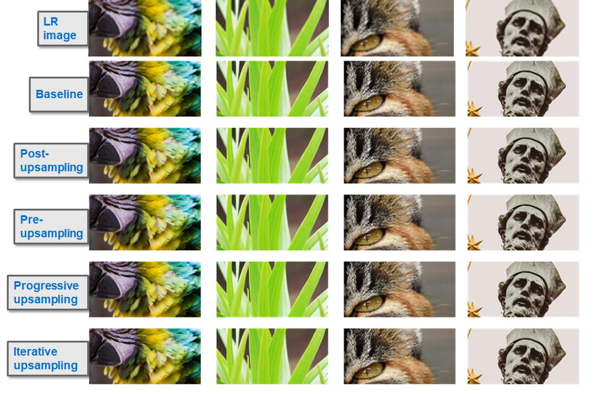

# Application of Deep Learning models in Single Image Super Resolution
Contributor: Xiuyu Liu; Qingqing Cao
## Description
Single image super-resolution (SISR), which aims to reconstruct a high-resolution (HR) image from a low-resolution (LR) observation, has been an active research topic in the area of image processing in recent decades.  Traditional methods improving image’s resolution include interpolation-based and construction based methods. In the near few years, people used learning-based methods to map low-resolution images to high-resolution images. In this project, we start from basic convolution neural networks (SRCNN) and experiment with different upsampling methods, architectures, and loss functions. Finally, we combined traditional signal processing methods with neural networks to improve images’ resolution.
The SRCNN models implemented in this project include:
- Baseline SRCNN model
- Modified SRCNN models with different up-sampling methods
- Modified SRCNN models with differrent archiectures
- Modified SRCNN models with different loss functions
- Applications of Signal Processing in SRCNN model

Here is the framework of this project:

## Dataset of Images
In this project, we use the [DIV2K dataset](https://data.vision.ee.ethz.ch/cvl/DIV2K/) for training and validation. It is a 1000-image dataset containing RGB images with a large diversity of contents. When training our deep learning model, we use 800 high resolution images and acquire corresponding low resolution using 4X downsampling. The images are also randomly cropped, flipped, and rotated to increase diversity. We are using another 100 images for validation. 
## Deep learning models used in the project
### Baseline SRCNN model
SRCNN is a deep learning model that was proposed in 2014 and  directly learns an end-to-end mapping between the low/high-resolution images. As shown below, the deep learning model has a lightweight structure, containing only three convolution layers. This network was published in the paper, "Image Super-Resolution Using Deep Convolutional Networks" by Chao Dong, et al. in 2014. Referenced Research Paper https://arxiv.org/abs/1501.00092. Our first task in this project is to implement the SRCNN model from scratch and use it as a baseline model. 

You can find our implementation [Here](https://github.com/XiuyuLiu/Optimization-of-SISR-based-on-DL/blob/main/Task1_architecture.ipynb). In the SRCNN model, a deep convolutional neural network takes the low-resolution image as the input and outputs the high-resolution one. The input images are first normalized and upsampled using bilinear interpolation methods to match the size of input and output images. Then, three convolution layers are used with ‘same’ padding and ‘relu’ activation. Then, the output images are denormalized to restore the RGB format. Mean Squared Loss is used as a loss function and an Adam optimizer with learning rate decay is used to train the model. In this project, the SRCNN model is developed in Keras, which is a high-level deep learning API on the basis of Tensorflow that provides a convenient way to define and train models. 
 (credit to: https://medium.com/coinmonks/review-srcnn-super-resolution-3cb3a4f67a7c)

### Modified SRCNN models with different up-sampling methods
To learn a map between low-resolution images and high-resolution images, in SRCNN, the low resolution images are first interpolated to obtain a ‘coarse’ high resolution image. The advantage of handling upsampling by the Bilinear interpolation is that the CNN only needs to learn  how to refine the coarse image, which is simpler. The disadvantage is that the predefined upsampling methods may amplify noise and cause blurring. Inspired by this, here we explore using a sub-pixel convolution layer as an upsampling layer and experiment with four different up-sampling methods. As is shown below, the four methods include pre-upsampling, post-upsampling, progressive upsampling, and up and down (iterative) upsampling methods.

### Modified SRCNN models with different Architectures
Although the baseline SRCNN model has demonstrated its capability to learn a map between low-resolution image and high-resolution image, it is still a relatively shallow neural network model with only three layers. Inspired by this point, we try to improve the performance of the SRCNN model by adding more layers. At the same time, to combat vanishing gradient problems and to accelerate convergence, we introduce global skip connection (residual block) and different kernel sizes in one layer (inception block). Each residual block contains two convolution layers and allows local skip connection. Each inception block contains 4 parallel convolution layers with kernel size of 9, 5, 3, and 1. The results of convolution layers are concatenated to generate the output.

### Modified SRCNN models with Different Loss Functions
Loss functions are used to measure the difference between the high-resolution images (ground truth) and super-resolution images (predicted results). This difference can be used to optimize the deep learning model. In the baseline SRCNN model, we use mean-squared-error (MSE) to quantify the pixel-wise difference between ground-truth image and generated image. This loss function directly maximizes the PSNR metric value and is reported to often generate images lacking high-frequency details. In this project, we also experimented with the content loss and texture loss to improve the generated image quality.

In the above equation, content loss is calculated using the high-level features of the HR image and SR image, which is extracted from a pre-trained VGG-19 net. Here we use the max-pooling layer results in the first and last blocks from the pre-trained network. Then, the texture loss is defined as the correlation between different feature channels. Then, we use the Gram matrix to calculate the correlation between the feature maps. The texture features are also extracted from the pre-trained VGG-19 net. 
In the end, we combine the pixel loss, content loss, and texture loss to build a loss function (Perceptual Loss) that minimizes the pixel error, content error, and texture error at the same time:

### Applications of Signal Processing in Super-Resolution Problem
In this section, we applied a traditional edge enhancement filter on the upsampled low-resolution images and output super-resolution images, as pre-processing and post-processing respectively. Edge enhancement technique aims to enhance the visibility of edges. It is widely applied in the printing and publishing industry,  radiographic images, manufacturing and military applications. 
The reason we apply this technique is that we usually observe blurry artifacts in low-resolution images, and edges usually contribute significantly to high-frequency image components. We hope to improve the sharpness and esthetic aspect of a picture by applying the edge-enhancement filter before and after the neural network.

## RESULTS AND DISCUSSIONS
### Baseline model results
The image below shows the loss decay of the baseline SRCNN model. In the training process, we optimize the model for 50 epochs, with 1000 updating steps per epoch and 16 as batch size for each step. The loss decays quickly in the first 10 epochs and then slows down until the loss stops to decay at around 30 epochs. 

Then, the image below visualizes the model performance by showing an example of the low-resolution image, super-resolution image, and high-resolution image. As we can observe, the SR image significantly improves the quality of LR image. Some blurry things are gone but it seems to be a smoothed image (lacking high-frequency details) compared with the HR image. The results confirm a successful implementation of our baseline SRCNN model. They also indicate the baseline SRCNN can be potentially improved if we focus on high-frequency restoration.

### Effect of Different Up-Sampling Methods, Architectures and Loss Functions
#### Effect of Different Up-Sampling Methods and Architectures
The first image below shows the observed loss when applying different up-sampling methods on the baseline SRCNN model. Different from using a fixed bilinear or bicubic interpolation to do up-sampling, the up-sampling methods discussed here are all using sub-pixel convolution layers and therefore they are learnable.
Regarding the ability of getting a small loss, it can be clearly concluded that pre-upsampling > progressive upsampling > iterative upsampling > post upsampling. It is also worth mentioning that the pre-upsampling method has the best convergence speed among the four methods.

The second image below shows the observed loss when changing the baseline SRCNN model by adding residual blocks or inception blocks. Compared with the baseline SRCNN model, it is clear that the residual architecture and inception architecture are better with respect to convergence speed and resultant loss. Although they reach similar results, we think the residual block and inception block have different working mechanisms. In  the residual blocks, the local skip connections solve the vanishing gradient problem and make the network easier to optimize. Besides, the residual network design ensures the information acquired in the beginning layers can be preserved as deep as possible. This point is very important as we want to preserve the majority of the information when learning a map between low-resolution images to high-resolution images. On another side, the inception block allows us to set different kernel filter sizes in one layer. Remember in the baseline SRCNN model, we use kernel sizes of 9, 5, and 5 in three layers. Using inception blocks add more flexibility regarding kernel sizes, which allows us to use 9, 5, 3, and 1 filter size in one layer.

 

#### Effect of Different Loss Functions
The image below shows the resultant super-resolution images using the baseline SRCNN model and four other up-sampling methods. The all five methods have significantly improved the resolution quality of the low-resolution images. We have shown in the previous section that the five methods have different overall losses on the dataset. However, we find it difficult to detect the differences between the resultant super-resolution images using five methods. It indicates that, if we train our model to use the same loss function (MSE loss), we will end up with similar super resolution results, no matter what kind of architecture we test. Therefore, there is a need to check the effect of different loss functions.

The image below shows the resultant super-resolution images using the baseline SRCNN with different loss functions. They have PSNR of 25.39, 25.32, and 24.75. As we can see, the mean-squared-error loss and the mean-absolute-error loss result in a relatively smooth image. Although the third image has the lowest PSNR, we think the perceptual loss results give us a more vivid image. The visual inspection confirms the advantage of using the perceptual loss in super-resolution problems. 

#### Applications of Signal Processing in Super-Resolution Problem
The image below shows the results of applying the edge-enhancement filter to the upsampled low-resolution images (pre-processing). We did not observe obvious differences in images with/without image pre-processing. The losses with/without pre-processing are also at the similar level. This is because the edge-enhanced images are further input into the neural network, thus the enhanced parts are cancelled out by the neural network. 

The image below shows the results of applying the edge-enhancement filter to the output of the neural network (post-processing). It is very obvious that the edge-enhancement filter exaggerates the high-frequency components and the details of the image are improved. However, it is necessary to find a balance between enhancing high-frequency components and inducing unwanted artifacts.

## Contribution
Covid Now app is a free and open source project developed by Xiuyu Liu (xiuyul2@illinois.edu) and Qingqing Cao (qc13@illinois.edu). Any contributions are welcome. Here are a few ways you can help:
* Report bugs and make suggestions.
* Write some code. Please follow the code style used in the project to make a review process faster.
 

## License
This application is released under MIT. Some of the used libraries are released under different licenses.
